# Malaria - System Design Document { #mal-agg-design-210 }

Version 2.1.0

## Background and Purpose

The Malaria Core Aggregate System Design document provides an overview of the design principles and guidance used to develop the digital data package for routine aggregate malaria reporting in countries’ HMIS. This document is intended for use by DHIS2 implementers at country and regional level to be able to support implementation and localisation of the package. The Malaria metadata package can be adapted to local needs and national guidelines. In particular, local work flows and national guidelines should be considered in the localization and adoption of the programs included in this package.

The data sets have all been based either on WHO recommendations and best-practice examples or published reporting frameworks [Disease surveillance for malaria control](https://apps.who.int/iris/bitstream/handle/10665/44851/9789241503341_eng.pdf;jsessionid=7D2258370F31444A72815B5CFB2E1FE8?ua=1?sequence=1).

These data sets will in many instances have to be adjusted to fit with national reporting systems, to varying degrees. On the one hand, there might be additional variables that are important in a national context which must be added. On the other hand, there might be information that is simply not available for reporting, for example if the data is not captured in the case-based registers at the clinical level.

## System Design Overview

### Package Structure

The malaria program consists of 3 different data sets that can be used at any given time based on the needs of the program:

| Dataset                  | Description     |
|---------|--------|
| **Malaria annual data**      | The malaria annual data set is recommended in all settings. It contains the key info on the target/catchment population. As the name indicates, this information is to only be collected once a year. This data set contains a mostly flat structure. It is suggested to assign the dataset at district level, though the assignment can change at local level depending on the availability of population data. |
| **Malaria burden reduction** | This is a monthly data set that is meant for areas in which malaria burden reduction is the priority.  The dataset is designed to report data at the lowest administrative level present in the organizational unit hierarchy.    |
| **Malaria elimination**      | This is a monthly data set intended for areas where malaria elimination is the priority.  The dataset is designed to report data at the lowest administrative level present in the organizational unit hierarchy.     |

>**NOTE**:
>
>The malaria elimination and malaria burden reduction data sets can be used either separately or in conjunction with one-another depending on the type of public health responses being implemented within a particular geographical area (ie. in one district the burden reduction data set may be used, while in another the malaria elimination data set may be used).

### Data Elements

The full list of data elements belonging to the different datasets can be found in the [Malaria Metadata Reference File](resources/metadata.xlsx).

Please note that there are a number of additional data elements that could potentially be used within the Malaria Burden Reduction and Malaria Elimination data sets, however are not currently assigned to either of the datasets. These data elements can be found within the Malaria unassigned data element group.

| Dataset                  | Unassigned DEs       |
|--------------------------|----|
| Malaria Burden Reduction | Migrant and mobile population (MMP) positive Malaria cases tested at community level Malaria confirmed cases (Mic + RDT) Plasmodium falciparum (Mic + RDT) Malaria cases positive at community level Migrant and mobile population (MMP) tested Migrant and mobile population (MMP) followed up for 14 days Mixed malaria species (Mic + RDT) Plasmodium vivax (Mic + RDT) Malaria tested cases (Mic + RDT) Malaria cases treated at community level Mixed/Other malaria species (Mic + RDT) |
| Malaria Elimination      | Malaria tested from cross-borders Malaria cases notified within (N1) timeframe of the guideline (24hrs) Malaria cases investigated within (N2)* timeframe of the guideline Malaria positive from cross-borders followed for 14 days Malaria positive from cross-borders Other malaria species (microscopy)      |

### Intended users

- **Health facility users**: capture and report key data on malaria activities
- **Program managers**: managers at national and sub-national level may be responsible for supporting data entry and analysis.
- **National and local health authorities**: to monitor and analyze the surveillance of data through dashboards and analytics tools, to conduct risk assessments and plan response measures; to generate reports for regional and global reporting

### Data Set - Malaria Annual Data

#### Population at risk

This disaggregation of the population was set as a category combination, as it is more efficient to disaggregate this population data element by the three age category options rather than create three data elements separately.

#### Interventions

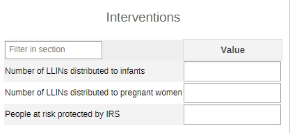

The section has a flat structure and focuses on the preventive interventions carried out in the target area and within the groups most at risk of infection. Contrary to the annual demographic data, this information is rather meant to be compiled at the end of a LLINs distribution intervention.

### Data Set - Malaria Burden Reduction

The Malaria Burden Reduction dataset is split in seven sections. Two of these sections are identical both in this dataset and in the Malaria Elimination dataset: Laboratory, Treatment.

#### Patients Volume

The age category combination (0-4, 5-14, 15+ years) drastically reduces the number of data elements. The totals for all of these data elements can also be used for analysis purposes.

#### Laboratory

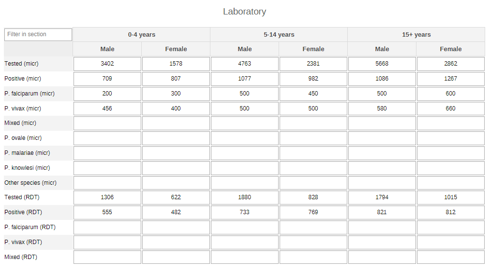

The age/sex category combination {Age (0-4, 5-14, 15+ years)/Sex (Male, Female)} drastically reduces the number of data elements. The totals for all of these data elements can also be used for analysis purposes; allowing you to pivot both the age and sex dimensions and place them where required.

#### Treatment

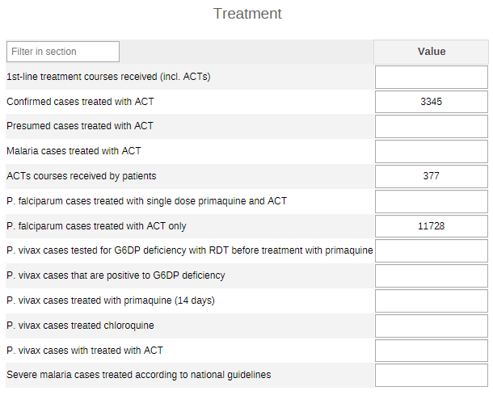

Several of the data elements in this section are subsets of one another. Making totals from these would not be meaningful. Though this increases the data element count, it makes interpreting the output easier.

#### Intermittent Preventive Treatment in pregnancy (IPTp)

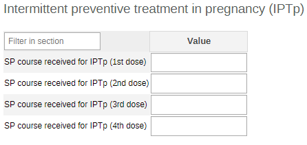

While it could potentially be argued that a category combination could potentially be used here in order to output the total number of doses administered, understanding the breakdown of the number of doses by their schedule takes precedence in the analysis. For this reason, no category combination is used.

#### Pregnant Women

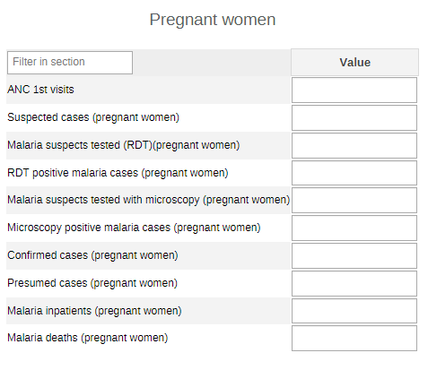

All of the data elements in this section have different definitions. No disaggregations required.

### Data Set - Malaria Elimination

The Malaria Elimination dataset is split in seven sections. Two of these sections are identical both in this dataset and in the Malaria Burden Reduction dataset: Laboratory, Treatment.

#### All-cause inpatients and outpatients

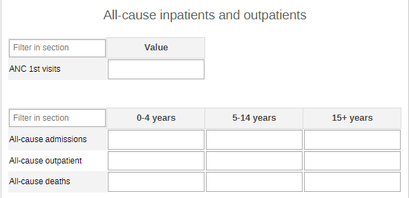

The age category combination (0-4, 5-14, 15+ years) reduces the number of data elements. The totals for the two data elements can also be used for analysis purposes.

#### Case Investigation

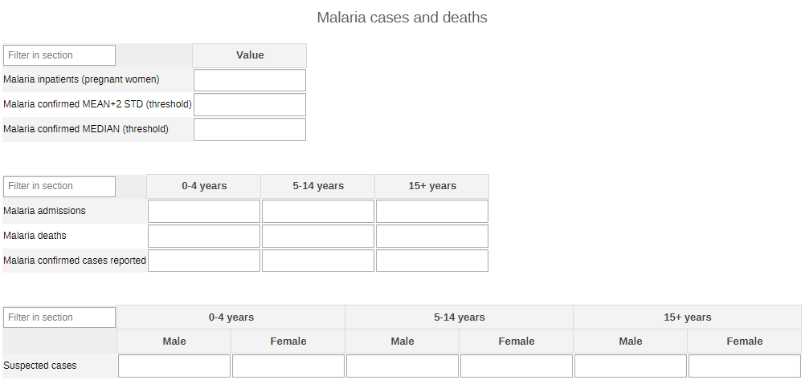

The age/sex category combination {Age (0-4, 5-14, 15+ years)/Sex (Male, Female)} drastically reduces the number of data elements. The totals for all of these data elements can also be used for analysis purposes.

#### Laboratory

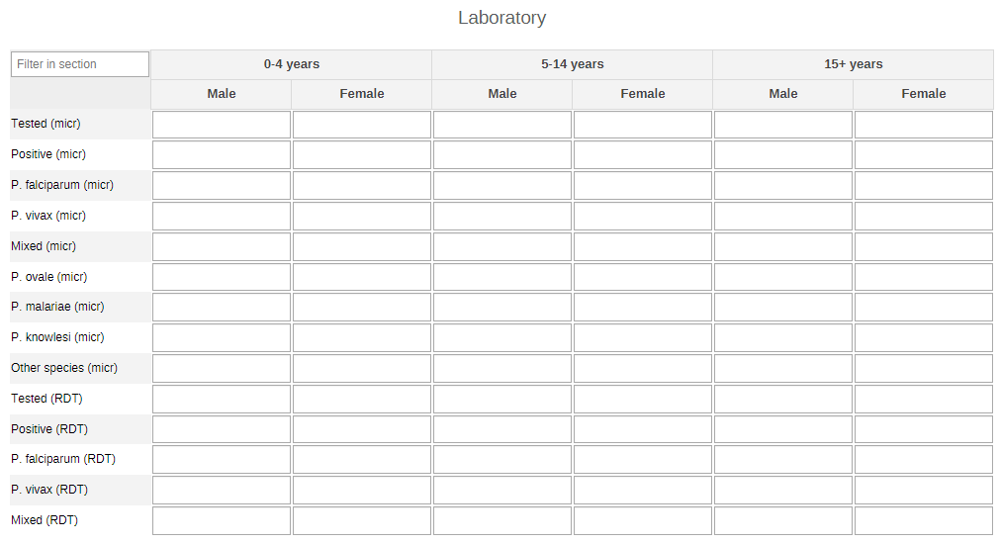

The age/sex category combination {Age (0-4, 5-14, 15+ years)/Sex (Male, Female)} drastically reduces the number of data elements. The totals for all of these data elements can also be used for analysis purposes; allowing you to pivot both the age and sex dimensions and place them where required.

#### Active Case Detection

All of the data elements in this section have different definitions. No disaggregations required.
Case Investigation

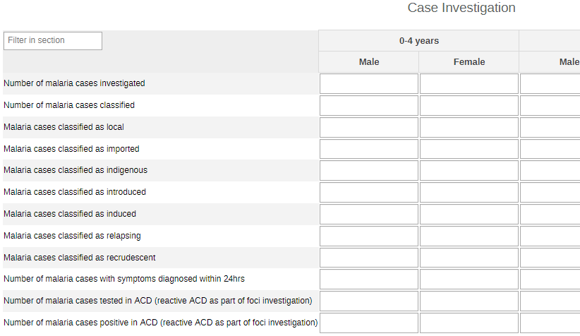

The age/sex category combination {Age (0-4, 5-14, 15+ years)/Sex (Male, Female)} drastically reduces the number of data elements. The totals for all of these data elements can also be used for analysis purposes; allowing you to pivot both the age and sex dimensions and place them where required.

#### Treatment

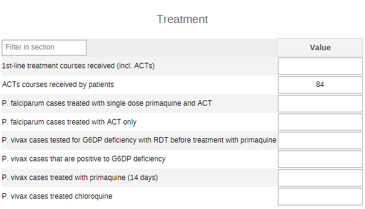

Several of the data elements in this section are subsets of one another. Making totals from these would not be meaningful. Though this increases the data element count, it makes interpreting the output easier.

#### Foci Investigation

Several of the data elements in this section are subsets of one another. Making totals from these would not be meaningful. Though this increases the data element count, it makes interpreting the output easier.

#### Foci Classification and Response

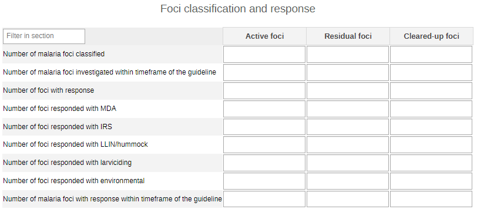

The foci classification category combination (Active, Residual, Cleared-up) allows for simplified classification of the data elements based on the three foci category options. The total of this category combination when applied to the data elements is useful for analysis as well.

#### Stock-out

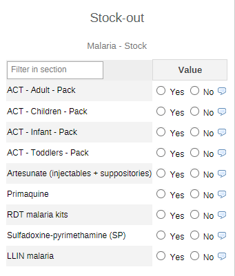

These data elements are all of yes/no type. No disaggregations required.
This section can be removed should the implementation require the uptake of the [MAL - Malaria stock dataset](https://docs.dhis2.org/en/topics/metadata/malaria/malaria-logistics/malaria-logistics-design.html) within the Malaria Package.

## Analytics and Indicators

The full list of indicators and indicator groups is available in the [Malaria Metadata Reference File](resources/metadata.xlsx).

Please refer to the section “Special Considerations: Malaria by health sector” of this design guide for further guidance on how to obtain further information on the cases of malaria detected in the different health sectors (private, public, and community).

## Validation Rules

The validation rules for malaria are divided across three groups:

- **Malaria: burden reduction**
- **Malaria: elimination**
- **Malaria: other**

The full list of validation rules that have been set-up to ensure the quality of data are available in the [Malaria Metadata Reference File](resources/metadata.xlsx).

## Dashboards

The Malaria package includes nine predefined dashboards, each focusing on different aspects of the preventive, curative, and reactive sides of the health programmes against malaria:

- MAL - 1.Malaria Burden Reduction
- MAL - 2.Testing and diagnosis
- MAL - 3.Malaria Maps
- MAL - 4.Treatment
- MAL - 5.Intervention Coverage
- MAL - 6.Malaria Quality Control
- MAL - 7.Malaria Data Quality
- MAL - 8.Malaria Elimination
- MAL - 9.Malaria Stock
- MAL - 10.Malaria District Dashboard

The full list of items (graphs and tables) available in each dashboard is available in the [Malaria Metadata Reference File](resources/metadata.xlsx).

The table below lists only the dashboards in which there are notes of interest for the implementation of the package and the set-up of the dashboards

| Dashboard                        | Comment   |
|--------------|-----|
| MAL - 1.Malaria Burden Reduction | In the graph and table entitled “Reported malaria cases “ , the DE MAL- Confirmed malaria cases (reported), depending on the local implementation and guidelines, could be used instead of the DE “confirmed malaria cases (micr + RDT)” The graph entitled “Epidemic detection” uses in its default configuration the DE MAL - Malaria confirmed MEAN+2 STD (threshold). Countries should choose either the mean+2SD OR the MEDIAN (threshold), but not both. The latter is suggested for elimination settings. The DEs are in the burden reduction data elements group. |
| MAL - 4.Treatment                | The graphs entitled “Treatment of P.vivax” and “G6PD testing and treatment of P.vivax” are optional and only relevant depending on the context.   |

### Malaria Data Quality Dashboard

This dashboard complements other DHIS2 apps and tools such as the [WHO Data Quality App for DHIS2](https://docs.dhis2.org/en/use/optional-apps/who-data-quality-tool/installation-and-configuration.html).

The main objective of the data quality dashboard is to bring key data quality metrics to the users routinely through use of DHIS2 dashboards to facilitate data quality improvement activities at all levels (health facility, district, and national management).

- Monitor completeness and timeliness of reporting malaria data: 
  - The default dashboard includes a text box with some key definitions to ensure the correct understanding and interpretation of the concepts of "completeness" by variable and by reporting frame, and "timeliness".
  - The legends in the pivot tables have been set with default values in reference to the global guidelines. They should be adapted according to the local guidelines if needed.
- Monitor internal consistency between variables to detect inconsistencies for quality improvements:
  - The text box in tghe consistency and validity section of the dashboard provides the guide for the interpretation of "consistency".
  - The scatterplots have been set by default to follow a 2xZ-score (high and low) - depending on the local efforts and allowance for discrepancies within variables, the Z-score can be adapted and adjusted.
- Compare trends of key malaria indicators at the various reporting levels and rapidly detect anomalies as red flags for poor data quality (year over year graphs).

Like all dashboard packages for DHIS2, the data visualizations are configured to display data for the organisation units for which the user has data capture access in the user configuration. In this way, the dashboard can be used at national, district or other sub-national levels to monitor data quality for the geographic area most relevant to the user. This enables actions to improve data quality to be taken as close to the point of data collection and validation as possible. Configuration of users and assignment to user groups to be able to access the dashboard should be considered within country context to ensure access is provided properly to users. 

### Malaria District Dashboard

The objective of this dashboard was to create an operational level (district or equivalent) specific dashboard to become one of the primary dashboards for district malaria managers. Depending on the organization of the malaria program, other levels can also find it useful - e.g. Health Facility level with just the population replace by service population. The added value of having a specific dashboard targeting district managers and/or Health Facility supervisors. Just need a name that qualify both/all.

The dashboard gives a primary at glance overview of the key information of the malaria activities that can be later drilled down with more detail in the more detailed dashboards dedicated to burden reduction, quality, stock, etc. 
The pivot tables provide the outline of the eventual decline of the core indicators for program monitoring keeping as reference the current period and the same previous period (e.g. current period January 2022, previous period January 2021). The applied legends use as thresholds placeholders taken from the global guidelines and should be locally adapted if need be.

## User groups

As part of the package configuration, user groups have been created to be used to manage sharing settings in the metadata for all the modules. Core metadata that use these sharing settings include mainly the dataSets, dashboard, indicators and data Elements.
The three user groups created include:

| User group       | Dashboard         | Metadata  | Data         |
|------------------|-------------------|-------------------|----------------------|
| MAL - Admin        | Can edit and view | Can edit and view | Can view only        |
| MAL - Access       | Can view only     | Can view only     | Can view only        |
| MAL - Data capture | No access         | Can view only     | Can capture and view |

Whereas it is important to maintain these userGroups while installing this package, feel free to review them in line with any existing userGroups setup or policy in the host instance.

## Special Considerations: Malaria data disaggregated by public facility vs. private sector vs community service delivery 

As mentioned in the section on Analytics and Indicators of this design guide, this section is set to provide some suggestions and considerations on the analysis and visualization of the detected cases of malaria according to the type of facility ownership (public or private), and the cases detected in the community.

The WHO requirements for the CORE malaria aggregate  data reporting included the following indicators:

- “MAL - Malaria cases detected in the public sector (%)”
- “MAL - Malaria cases detected in the private sector (%)”
- “MAL - Malaria cases detected in the community (%)”

Given the wide range of set-ups and configurations of the hierarchy and organizational units (OUs), this section will advise the users and implementers a few solutions and propositions.

**Scenario 1**: Community data and/or private sector facilities are maintained as their own organisation units in the DHIS2 org unit hierarchy. 
* The same data elements can be reused, while orgunit groups can enable filtering and org unit group sets can enable slicing/disaggregating the data by public/private/community. For example, an Org Unit Group Set for 'Facility/Service Delivery Type' can contain org unit groups for Public Facility, Private Facility, CHW to disaggregate reported malaria cases, tests, etc/

**Scenario 2**: Community and/or private sector data are not reported through separate org units, but instead reported at (public) facility or district level
* In this scenario, separate data elements for community or private sector reported data can be created to signify the source of reporting; new indicators can be added to sum up community, private sector and facility cases reported across these data elements. This can be the case when using the CHIS package for malaria, which contains a separate set of data elements for community reporting of malaria cases. 
* Another alternative is to add a facility/private sector/community category for disaggregation of 1) data elements, or 2) the whole data set. In this case, indicators for malaria cases by public vs. private vs. community would need to be configured for each CatCombo. 

### Malaria cases detected in the public and private sector

As of the latest DHIS2 version release (2.37), indicators counting the number of organisation units (e.g. facilities) can only be obtained by setting up a **predictor**.

In order to ease the technical configuration of the package, a solution to this could be the use of a DE or an indicator (e.g. MAL - Confirmed malaria cases (micr + RDT) or MAL - Malaria cases detected) and filter the analysis by the groupSet assigned to the OUs (private or public).

In the screenshot below, an example of the Private and Public OU Groups and below the facilities selected to belong to the Public group.

Once the OUs are arranged by OU groups, the Public and Private groups can be further categorized in an “Ownership” OU Group Set and it should be of type data dimension for it to be used as analytic filter or dimension.

Once the data is entered in the datasets in all the required OUs, the user can analyze the data in the system by health sector. Depending on the final purpose of this specific analysis, the data can be visualized using the wide range of DHIS2 core analytics. 
The examples below show some of the visualizations that can be obtained when analyzing the malaria data by "Ownership".

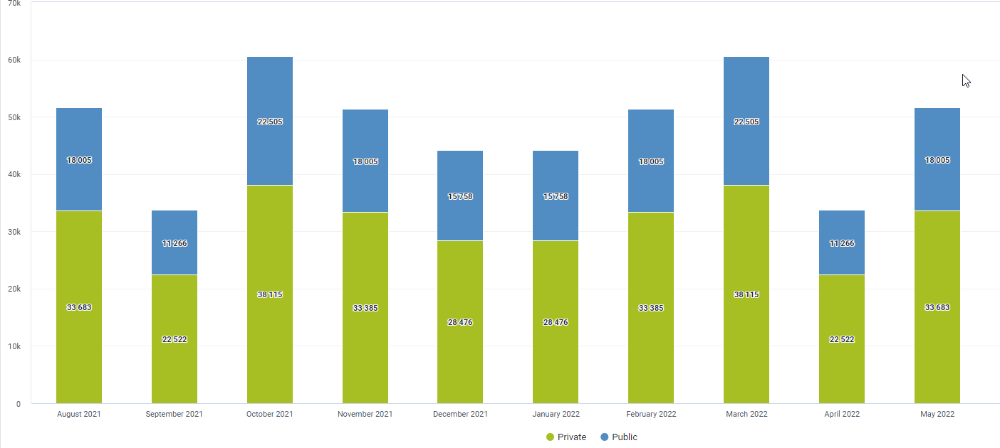

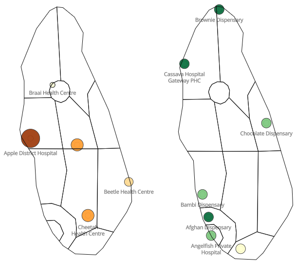

### Malaria cases detected in the community

Depending on the local implementation and context, the community level of the health activities and interventions can either be set-up aside, or can be already fully integrated among the health facilities and various admin levels of the OUs.

There are two options that can be used in order to analyze the data coming from the community: 
1) Use the same approach as outlined in the previous section and create an OU group for the communities in the hierarchy. The procedure and analysis of the data will then follow the same method as the public and private OU groups.  
2) Download and update the relevant metadata from the [Community Health Information System (CHIS) package](#chis-system-design), map the relevant metadata, and triangulate the information with the ones obtained from the malaria package(s).
In particular there are two monthly datasets that can be useful for this specific purpose within the CHIS package: The [CH - Malaria](#ch-mal-aggregate-design) dataset and the [CH - Community-based Surveillance](#ch-cbs-aggregate-design) dataset. Some relevant DEs for the data triangulation of malaria information can also be obtained from the [CH - Integrated Community Case Management](#ch-iccm-aggregate-design) monthly dataset in the CHIS package.

## References

World Health Organization (2012). Disease Surveillance for Malaria Control. An operational manual. Printed by the WHO Document Production Services, Geneva, Switzerland. ISBN 978 92 4 150334 1. URL: [https://apps.who.int/iris/bitstream/handle/10665/44851/9789241503341_eng.pdf;jsessionid=7D2258370F31444A72815B5CFB2E1FE8?ua=1?sequence=1](https://apps.who.int/iris/bitstream/handle/10665/44851/9789241503341_eng.pdf;jsessionid=7D2258370F31444A72815B5CFB2E1FE8?ua=1?sequence=1)
